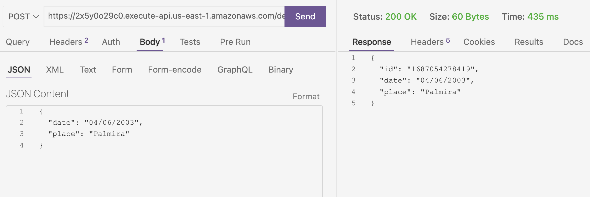

# Serverless-dynamo-ci-cd 🎉

In this technical test, you are asked to implement a serverless solution for the
creating an API using AWS Lambda, which records data in DynamoDB. all the
Deployment should be automated through GitLab CI and a repository on GitLab.

## Contextualization

**What is AWS Lambda used for?**

AWS Lambda function is very flexible and supports various use cases:

- Event driven applications: AWS Lambda can be triggered from a number of different event sources. Examples include triggering when a database row is updated, and triggering when the message count in a queue is greater than a certain number.

- Web and mobile backends: For a Mobile touchscreen, GUI event can be integrated with AWS Lambda using AWS API Gateway to trigger the Lambda function by calling the microservice-http-endpoint.

- Machine learning and data processing: As AWS Lambda supports Python, it is well suited for machine learning as well as data analytics applications, because ML and Data Analytics applications rely heavily on Python and its libraries (Numpy, TensorFlow, MatPlotlib Scipy etc.)

**What is DynamoDB used for?**

DynamoDB is a key-value and document database that delivers single-digit millisecond performance at any scale. It's a fully managed, multiregion, multimaster, durable database with built-in security, backup and restore, and in-memory caching for internet-scale applications.

## Analysis

- Needs of the interested parties

    In HABI it is required that through an API it is possible to register the visits that a
    property in a DynamoDB table, where the date and place of the visit are recorded.

- Functional requirements

1. Serverless solution using AWS Lambda and DynamoDB.
2. The API must be configured with the minimum of security privileges.
3. Automatized integration and deployment through GitLab CI/CD.

- Non-functional requirements

1. The solution will satisfy scalability, security and availability qualities attributes.

## Design

- Schemas

```ts
class property {
  id: string;
  name: string;
  address: string;
  price: number;
  visits: visit[];
}

class visit {
  id: string;
  propertyId: string;
  date: string;
  place: string;
}
```

In the previous schemas, the relationship between the property and the visit is
one-to-many, since a property can have several visits. For the implementation we will only
consider the **visit schema** due to the simplicity of the exercise.

- Infrastructure


## Implementation

- Infrastructure as code with Terraform

    ```bash
    terraform validate
    terraform plan
    terraform apply
    ```

- Output should be something like this

    ```bash
    api_gateway_id = "2x5y0o29c0"
    api_gateway_url = "https://2x5y0o29c0.execute-api.us-east-1.amazonaws.com"
    dynamodb_table_name = "visits"
    lambda_function_arn = "arn:aws:lambda:us-east-1:163740413966:function:saveVisit"
    lambda_function_name = "saveVisit"
    ```

- Evidences

    
    
    
    
    

- Pipiline

    1- Clients send request our microservices by making HTTP API calls. 
    Ideally, our clients should have a tightly bounded service contract to our API 
    in order to achieve consistent expectations of microservice responsibility.

    2- Amazon API Gateway hosts RESTful HTTP requests and responses to customers. In this scenario, API Gateway provides built-in authorization, throttling, security, fault tolerance, request/response mapping, and performance optimizations.

    3- AWS Lambda contains the business logic to process incoming API calls and leverage DynamoDB as a persistent storage.

    4- Amazon DynamoDB persistently stores microservices data and scales based on demand. Since microservices are often designed to do one thing well, a schemaless NoSQL data store is regularly incorporated.

    So When we invoke our API Gateway API, API Gateway routes the request to your Lambda function. The Lambda function interacts with DynamoDB, and returns a response to API Gateway. API Gateway then returns a response to us.

- Serverless code

The code is in the `api` folder. Where you can see that we have a `index.js` file
which is the one that will be executed by the lambda function. This file is in charge of
saving the visit in the DynamoDB table.

## Deployment





## Continuous Integration and Continuous Deployment

- GitLab CI/CD

    We define two stages: build and deploy.

    1. In the stage build, we create a job called build_zip.
    2. In the job script, we use the zip command to create a ZIP file called my_code.zip containing the files in the <code-folder> folder. Be sure to replace <code-folder> with the actual path of the folder that contains your code.
    3. In the deploy stage, we create a job called deploy_lambda.
    
**Remarks:**

We use the official AWS CLI image to run the AWS commands. In the job script, we set the AWS access credentials using the $AWS_ACCESS_KEY_ID and $AWS_SECRET_ACCESS_KEY environment variables. We set the AWS Region using the $AWS_REGION environment variable. We run the aws lambda update-function-code command to push the latest changes to the specifiedLambda function. In this case, we use the ZIP file my_code.zip. Be sure to replace <name-of-your-lambda-function> with the actual name of your function. We added the dependencies directive in the deploy_lambda job to indicate that it depends on thebuild_zip job. This will ensure that the ZIP file is created before attempting to deploy it.    

## Conclusion

With this technical test, I was able to pratice with AWS Lambda and DynamoDB
services, as well as with Terraform for the infrastructure as code. I also implemented a CI/CD pipeline with GitLab CI/CD.
